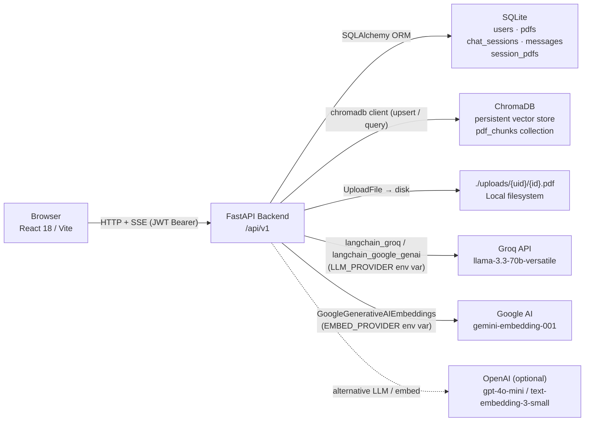
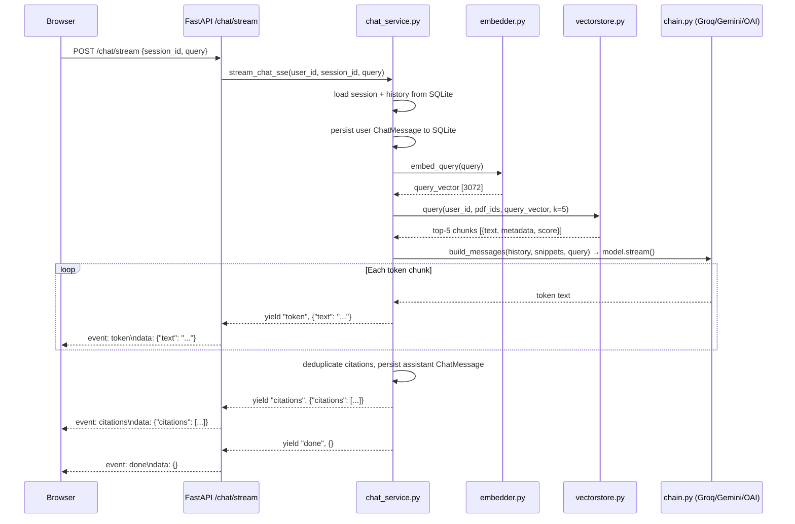

# Atlas — Architecture Deep-Dive

## Overview

Atlas is a RAG-powered PDF chat application: users upload PDF documents, and the system answers their questions using retrieved context from those documents, streaming tokens in real time with marginalia-style citations that link back to the exact source passage. What distinguishes it from a basic "chat over a file" demo is the full vertical slice it implements — JWT authentication, per-user storage isolation enforced at both the SQL and vector layers, a provider abstraction that swaps the entire LLM and embedding stack through environment variables, a custom editorial design system, and a retrieval evaluation harness. The frontend is a production-quality React SPA with a bespoke editorial-cartographic visual language; the backend is a clean-layered FastAPI service with no business logic leaking into the HTTP routing layer.

---

## High-level architecture



### Chat-stream sequence (one request, end to end)



---

## The RAG pipeline

The pipeline lives entirely in `backend/app/rag/`. Each file is a single-responsibility module: loader, chunker, embedder, vectorstore, pipeline (the orchestrator), and chain (the LLM layer). This makes each step unit-testable in isolation using fakes.

### Loading

`backend/app/rag/loader.py` uses `pypdf`'s `PdfReader` to iterate over pages. It extracts text one page at a time and returns a list of `(page_number, text)` tuples — 1-based page numbers to match human-readable citation references. Pages where `extract_text()` returns an empty or whitespace-only string are silently dropped. This matters for scanned PDFs (image-only pages) and cover art pages that contain no machine-readable text; they are logged and skipped without failing the whole document.

The design choice to retain page numbers in tuples — rather than concatenating all text into one string before chunking — is deliberate. It lets the chunker carry the source page number forward as metadata on every chunk, which is what ultimately makes citation "Page N" references accurate.

### Chunking

`backend/app/rag/chunker.py` wraps `RecursiveCharacterTextSplitter` from `langchain.text_splitter`:

```python
splitter = RecursiveCharacterTextSplitter(
    chunk_size=1000,
    chunk_overlap=200,
    separators=["\n\n", "\n", " ", ""],
)
```

The 1000-character chunk size is a practical middle ground for dense text. Smaller chunks (e.g., 400–500 chars) produce more precise retrieval but risk truncating a complete thought mid-sentence, making the LLM context harder to use. Larger chunks (2000+) waste embedding capacity on context that isn't relevant and push against the effective context window for retrieval. At 1000 characters with `gemini-embedding-001`'s 3072-dimensional output, the signal-to-noise ratio is reasonable for typical business and academic documents.

The 200-character overlap prevents the case where a sentence straddles a boundary and gets split between two adjacent chunks, both of which end up with incomplete meaning. The separator list — `["\n\n", "\n", " ", ""]` — tells the splitter to prefer breaking at paragraph boundaries first, then line breaks, then words, then character boundaries as a last resort. This keeps chunks semantically cohesive.

Each `Chunk` dataclass carries `text`, `page` (inherited from the source page tuple), and a monotonically incrementing `chunk_idx` used as part of the Chroma document ID.

### Embedding

`backend/app/rag/embedder.py` defines an `Embedder` protocol (structural typing) rather than a concrete class. Both the Gemini and OpenAI implementations satisfy `embed_documents(texts) -> list[list[float]]` and `embed_query(text) -> list[float]`. This is what makes the provider swap work without conditional logic scattered through the pipeline.

The default is `GoogleGenerativeAIEmbeddings(model="models/gemini-embedding-001")`, which produces 3072-dimensional vectors. OpenAI's `text-embedding-3-small` produces 1536 dimensions. These are not interchangeable: if you switch `EMBED_PROVIDER` after documents have already been embedded and stored in Chroma, the query vector and the stored vectors will have different dimensionality and the similarity calculation will error. You must drop and recreate the Chroma collection when changing embedding providers — a known operational constraint documented in `.env.example`.

Batching is handled in `backend/app/rag/pipeline.py`:

```python
for i in range(0, len(texts), 100):
    embeddings.extend(embedder.embed_documents(texts[i : i + 100]))
```

The batch size of 100 is a pragmatic limit. The Gemini Embeddings API imposes a per-request content limit; sending 500 chunks in a single request risks hitting that limit and failing the whole document. Batching at 100 means a 200-page academic paper (roughly 600–800 chunks at this chunk size) completes in 6–8 API calls, with a partial failure retryable per batch. For the MVP this error handling is not yet implemented — any exception during the embedding loop causes the entire document to move to `status='failed'`.

### Vector store

`backend/app/rag/vectorstore.py` manages a single Chroma `PersistentClient` behind an `lru_cache`, so the connection is initialized once per process. All chunks go into a single collection named `pdf_chunks` with cosine distance metric (`{"hnsw:space": "cosine"}`).

Each document in the collection has this shape:

| Field | Value |
|---|---|
| `id` | `"{pdf_id}:{chunk_idx}"` |
| `document` | chunk text |
| `embedding` | float list (3072 or 1536 dims depending on provider) |
| `metadata.user_id` | owner's user ID |
| `metadata.pdf_id` | source PDF ID |
| `metadata.filename` | original filename |
| `metadata.page` | 1-based page number |
| `metadata.chunk_idx` | global chunk index within the PDF |

The retrieval filter is constructed as:

```python
where = {"$and": [{"user_id": user_id}, {"pdf_id": {"$in": pdf_ids}}]}
```

Filtering on both `user_id` and `pdf_id` simultaneously is intentional defense-in-depth. The SQL layer (via `session_pdfs` joins and `Pdf.user_id` checks) already prevents cross-user data access. But because Chroma is a separate data store, a bug in the service layer that passed the wrong `pdf_ids` could — without the `user_id` filter — potentially return chunks belonging to another user's document that happened to share the same PDF ID. The double filter makes user isolation a property of the vector store query itself, independent of whatever the calling code believes.

### Retrieval

The query call in `vectorstore.py` retrieves the top `k=5` closest chunks by cosine distance. Five chunks is enough to give the LLM substantive context without overwhelming the prompt, and it keeps latency manageable on Groq's fast inference endpoint. The `scores` returned are Chroma's cosine distances (lower is more similar), currently logged but not acted upon — there is no distance threshold that filters out low-relevance results. Adding a minimum-similarity cutoff is a straightforward improvement for a production system.

Re-ranking (e.g., with a cross-encoder like `cross-encoder/ms-marco-MiniLM-L-6-v2`) would improve precision on ambiguous queries by re-scoring retrieved chunks using the query-chunk pair jointly rather than independently. It is not implemented in the MVP, but the architecture supports adding it between the `vectorstore.query` call and the `build_messages` call in `chat_service.py`.

### Context injection

`backend/app/rag/chain.py` assembles the message list in `build_messages`:

```python
SYSTEM_PROMPT = """You are a precise document Q&A assistant.
Answer ONLY using the provided context snippets.
If the answer is not in the context, say you don't have enough information.
When citing, reference snippets by their bracketed numbers like [1], [2].
Be concise."""
```

The prompt structure, in order:

1. A `SystemMessage` with the instruction above.
2. The last 6 messages from session history (3 exchanges), interleaved as `HumanMessage` / `AIMessage`.
3. A final `HumanMessage` containing the numbered context block — `format_context` renders each snippet as `[N] (filename p.PAGE) text` — followed by the user's question.

The history window of 6 is a deliberate cost–quality trade-off. More context means better multi-turn coherence but higher token cost per request. For most document Q&A sessions, the question at turn 7 rarely depends on the precise wording of turn 1; 6 messages covers roughly 3 back-and-forth exchanges, which handles the common "follow up on that" pattern well.

### Streaming

`chain.py`'s `stream_response` calls `model.stream(messages)` and yields each content chunk:

```python
def stream_response(model, messages) -> Iterable[str]:
    for chunk in model.stream(messages):
        if chunk.content:
            yield chunk.content
```

`chat_service.py`'s `stream_chat` generator wraps this, appending each token to an in-memory list and also yielding it as an SSE event. After the generator exhausts:

1. The full accumulated text and deduplicated citations are persisted to `chat_messages`.
2. A `citations` SSE event is emitted with the resolved citation list.
3. A `done` SSE event is emitted.

Citation deduplication happens by `(pdf_id, page)` key. If two retrieved chunks came from the same page, only one citation entry is emitted, avoiding redundant footnotes for the same source location.

The `FastAPI` route wraps the async generator in a `StreamingResponse` with `media_type="text/event-stream"` and the `X-Accel-Buffering: no` header — this header is necessary when the application sits behind an nginx reverse proxy, which by default buffers upstream responses and would break SSE.

---

## Data model

### SQLite / SQLAlchemy

All models are in `backend/app/db/models.py`. IDs are hex-encoded UUIDs (`uuid4().hex`), chosen over integer primary keys to avoid enumerable IDs and to make rows portable if the project ever migrates to a distributed environment.

**`users`**

| Column | Type | Notes |
|---|---|---|
| `id` | String(32) PK | hex UUID |
| `email` | String(255) UNIQUE | case-sensitive as stored |
| `password_hash` | String(255) | bcrypt via passlib |
| `created_at` | DateTime | UTC, set at insert |

**`pdfs`**

| Column | Type | Notes |
|---|---|---|
| `id` | String(32) PK | hex UUID |
| `user_id` | FK → users.id | CASCADE on delete |
| `filename` | String(512) | original uploaded name |
| `storage_path` | String(1024) | `./uploads/{user_id}/{id}.pdf` |
| `size_bytes` | Integer | validated against `MAX_UPLOAD_MB` |
| `status` | String(16) | `processing` → `ready` or `failed` |
| `error` | Text, nullable | first 500 chars of exception message if failed |
| `page_count` | Integer, nullable | set after successful processing |
| `chunk_count` | Integer, nullable | set after successful processing |
| `created_at` | DateTime | UTC |

**`chat_sessions`**

| Column | Type | Notes |
|---|---|---|
| `id` | String(32) PK | hex UUID |
| `user_id` | FK → users.id | CASCADE on delete |
| `title` | String(255) | auto-set to first 60 chars of first user message |
| `created_at` | DateTime | UTC |
| `updated_at` | DateTime | UTC, `onupdate=datetime.utcnow` |

**`chat_messages`**

| Column | Type | Notes |
|---|---|---|
| `id` | String(32) PK | hex UUID |
| `session_id` | FK → chat_sessions.id | CASCADE on delete |
| `role` | String(16) | `"user"` or `"assistant"` |
| `content` | Text | full message body |
| `citations` | JSON, nullable | `[{pdf_id, filename, page, snippet}]`; null for user messages |
| `created_at` | DateTime | UTC |

**`session_pdfs`**

| Column | Type | Notes |
|---|---|---|
| `session_id` | FK → chat_sessions.id | composite PK, CASCADE |
| `pdf_id` | FK → pdfs.id | composite PK, CASCADE |

`session_pdfs` is the join table that records which PDFs are active for a given chat session. Mid-session PDF switching — when the user checks or unchecks a PDF in the sidebar — fires `PATCH /chat/sessions/{id}` with the new `pdf_ids` list. `chat_service.update_session_pdfs` deletes all existing `SessionPdf` rows for the session and inserts the new set, within a single transaction.

### Chroma collection schema

Collection name: `pdf_chunks`. Created with `get_or_create_collection(name="pdf_chunks", metadata={"hnsw:space": "cosine"})`. There is no explicit schema enforcement in Chroma; the metadata structure is a convention maintained by the application. Document IDs follow the pattern `"{pdf_id}:{chunk_idx}"`, which makes `upsert` idempotent — re-processing a PDF with the same chunks overwrites the existing embeddings rather than creating duplicates.

---

## API surface

All routes are registered under `/api/v1` via `backend/app/api/v1/__init__.py`. Authentication uses `Authorization: Bearer <jwt>` on every route except `/auth/signup` and `/auth/login`. Errors return `{detail: str}` with standard HTTP status codes.

| Method | Path | Auth | Shape / Notes |
|---|---|---|---|
| `POST` | `/auth/signup` | No | `{email, password}` → `{access_token, user}` |
| `POST` | `/auth/login` | No | `{email, password}` → `{access_token, user}` |
| `GET` | `/auth/me` | JWT | `{user}` — validates token |
| `POST` | `/pdfs` | JWT | multipart `files[]` → `[{pdf}]`; enqueues `process_pdf` via `BackgroundTasks` |
| `GET` | `/pdfs` | JWT | `[{pdf}]` — caller's PDFs only |
| `DELETE` | `/pdfs/{id}` | JWT | 204; removes file from disk and vectors from Chroma |
| `POST` | `/chat/sessions` | JWT | `{pdf_ids[]}` → `{session}` |
| `GET` | `/chat/sessions` | JWT | `[{session}]` — includes `pdf_ids` per session |
| `GET` | `/chat/sessions/{id}` | JWT | `{session, messages[]}` — messages include citations JSON |
| `PATCH` | `/chat/sessions/{id}` | JWT | `{pdf_ids[]}` → `{session}` — replaces active PDF set mid-session |
| `POST` | `/chat/stream` | JWT | `{session_id, query}` → SSE stream: `token`, `citations`, `done` events |
| `GET` | `/healthz` | No | `{status: "ok"}` |

The Swagger UI at `http://localhost:8000/docs` is enabled in development and can be used for manual API exploration.

---

## State management on the frontend

The frontend uses two complementary state libraries with clearly separated responsibilities: React Query (TanStack Query) for server state and Zustand for client-side ephemeral and persisted UI state.

### Why React Query for server state

Server state — the list of PDFs, chat sessions, session messages — is remote data that can change outside the browser (e.g., a PDF finishes processing). React Query handles cache invalidation, refetching on window focus, background updates, and loading/error states. Implementing the same with `useEffect` + `useState` would require recreating those behaviors manually. The query keys are hierarchical: `["pdfs"]`, `["sessions"]`, `["session", id]`. Mutations call `qc.invalidateQueries` on the appropriate key to trigger background refetches.

### Why Zustand for client state

UI state that doesn't belong to a server resource — dark mode preference, upload drawer open/closed, which citation is currently active in the source panel — lives in Zustand. The `uiStore` persists `darkMode` to `localStorage` via the `persist` middleware; `activeCitation` and `uploadOpen` are ephemeral and reset on page reload, which is correct behavior. Zustand's minimal boilerplate (no reducers, no action creators) fits a single-developer project where the primary audience is a hiring manager who will review the code.

### The `selectedPdfIds` ↔ session sync flow

Mid-session PDF switching is a non-trivial UX problem. The user may check or uncheck a PDF in the sidebar while a session is active. The `AppPage` component holds local `selectedPdfIds` state. When the user toggles a PDF, `handleTogglePdf` updates local state immediately (optimistic) and fires `useUpdateSessionPdfs.mutate`, which calls `PATCH /chat/sessions/{id}`. On the backend, `update_session_pdfs` replaces the `session_pdfs` rows atomically. The session detail query is then invalidated and refetched.

When the user selects a different session from the sidebar, the `useSession(activeSessionId)` query fires. The `useEffect` in `AppPage` watches `session?.pdf_ids.join(",")` and writes the server-authoritative value back to local `selectedPdfIds`. This resolves any drift between what the user toggled locally and what the server persisted.

### The `useChatStream` hook and the refetch timing problem

The streaming hook (`frontend/src/hooks/useChatStream.tsx`) maintains in-flight streaming state locally — `{sessionId, query, text, citations}` — outside React Query because React Query is not designed to manage streaming partial responses. The hook uses the `Fetch` API and `ReadableStream` to parse the raw SSE byte stream (see `frontend/src/services/chat.tsx`), parsing `event:` and `data:` lines from double-newline-separated blocks.

The critical ordering in the `finally` block:

```typescript
await qc.refetchQueries({ queryKey: ["session", sessionId], exact: true });
qc.invalidateQueries({ queryKey: ["sessions"] });
setBusy(false);
setStreaming(null);
```

The `await` on `refetchQueries` (not `invalidateQueries`) is deliberate. `invalidateQueries` marks the query as stale and schedules a background refetch but does not wait for it to complete. If `setStreaming(null)` were called before the refetch completed, the in-flight bubble — the optimistic UI showing the streaming text — would disappear before the persisted `ChatMessage` arrived in the React Query cache, causing a visible flash where all messages briefly vanished. By awaiting the refetch, the persisted messages are in the cache before the streaming state is cleared, so the transition is seamless.

---

## Design system and UI patterns

The design direction is editorial-cartographic: the visual language of academic journals and annotated maps, applied to a document Q&A interface. The goal is to look distinctive without being loud — no gradients, no shadows, no glassmorphism.

### Type stack

| Role | Font | Notes |
|---|---|---|
| Display / headings | Fraunces (serif, variable) | Optical size axis (`opsz`) used at 144 for headings to subtly increase contrast. |
| Body / UI | Geist Sans | Clean, legible at small sizes. OpenType feature `ss01`, `cv11` enabled globally. |
| Monospace / citations | Geist Mono | Used for citation index labels, metadata ("Page 3"), and all-caps tracking labels. |

### OKLCH palette

The design token system (in `frontend/src/index.css`) uses OKLCH throughout rather than HSL or hex. OKLCH's perceptual uniformity means that foreground–background contrast ratios are predictable across hues without manual tuning. The warm tilt (hue ~65–75 in light mode) gives the interface a parchment-adjacent feel without being precious about it.

The accent color is `oklch(58% 0.18 45)` in light mode — a terracotta orange with enough chroma to draw the eye to citation markers and interactive elements without competing with body text. Dark mode shifts the accent to `oklch(70% 0.16 45)`, lighter to maintain contrast against the dark background.

### Marginalia citations

The citation UI has two levels. When the LLM embeds a `[1]` reference in its response text, `MessageBubble` (`frontend/src/components/chat/MessageBubble.tsx`) splits the content on the `[n]` pattern and replaces each match with a `CitationInline` component — a superscript in Geist Mono, terracotta-colored, that shows a hover tooltip with filename and snippet preview. Below each assistant message, a `CitationsBlock` renders a footnote list (`CitationFootnote` components) separated from the body by a short rule.

Clicking a citation — either the inline superscript or a footnote — sets `activeCitation` in `uiStore`, which opens the `SourcePanel` slide-in panel. The panel (`frontend/src/components/chat/SourcePanel.tsx`) is a fixed right-side drawer that renders the citation's `filename`, `page`, and `snippet` in a blockquote styled in Fraunces italic. ESC closes it.

This two-level system — hover for quick preview, click for full panel — matches how people actually navigate source material: glancing at a footnote to decide whether to follow it.

### Why no shadows or glassmorphism

Box shadows and backdrop filters add visual weight and suggest depth that this interface doesn't need. The hierarchy is established through typography weight, ink opacity, and a strict border system (`rule` and `rule-strong` tokens). Surfaces are either `bg` (the page) or `surface` (cards, panels), and the distinction is made through the rule/border rather than elevation. This also performs better on low-end hardware — no blur filters means no GPU compositor layers.

---

## Provider abstraction

The entire LLM and embedding stack is selected at startup through two environment variables: `LLM_PROVIDER` (defaults to `groq`) and `EMBED_PROVIDER` (defaults to `gemini`). The implementation is in `backend/app/rag/chain.py` (`build_chat_model`) and `backend/app/rag/embedder.py` (`get_embedder`).

Each function reads `get_settings()`, branches on the provider string, imports the appropriate LangChain integration, and returns an object that satisfies the LangChain `BaseChatModel` or the local `Embedder` protocol. The rest of the pipeline — `pipeline.py`, `chat_service.py`, `chain.py`'s `stream_response` — never references a specific provider.

```python
# backend/app/rag/chain.py
def build_chat_model():
    s = get_settings()
    if s.llm_provider == "groq":
        from langchain_groq import ChatGroq
        return ChatGroq(model=s.groq_chat_model, api_key=s.groq_api_key, streaming=True, temperature=0.2)
    if s.llm_provider == "gemini":
        from langchain_google_genai import ChatGoogleGenerativeAI
        ...
    if s.llm_provider == "openai":
        from langchain_openai import ChatOpenAI
        ...
```

The deferred imports (`from langchain_groq import ...` inside the `if` block) mean that the `langchain_groq` package is only imported if that provider is active. This avoids import-time failures when a provider's package is installed but its API key is absent, and it keeps startup fast.

**Why this matters:**

- **Cost flexibility.** The default configuration uses Groq's free tier for chat (~300 tokens/second on `llama-3.3-70b-versatile`, 14,400 requests/day) and Google AI Studio's free tier for embeddings — a fully functional setup at zero cost for a portfolio demo.
- **Vendor risk hedging.** If Groq's free tier changes or a model is deprecated, switching to Gemini or OpenAI is a single environment variable change with no code change.
- **Portfolio signal.** A hiring manager reviewing the code can see that the author understands how to build against an abstraction rather than a specific API, which translates directly to production systems where vendor lock-in is a real concern.
- **Testing.** The tests in `backend/tests/conftest.py` inject a `FakeEmbedder` and a fake chat model via FastAPI's dependency override system. The provider abstraction is what makes this possible: the dependency injection point is `get_embedder()` and `build_chat_model()`, not specific provider constructors.

---

## Trade-offs and explicit non-goals

| Decision | What was chosen | What was given up |
|---|---|---|
| SQLite over Postgres | Zero-dependency local setup; SQLAlchemy models are Postgres-compatible | No concurrent writes; WAL mode helps but won't scale beyond a few simultaneous users; no connection pooling; Alembic migrations are slightly less powerful without a real DB server |
| FastAPI `BackgroundTasks` over Celery/RQ | No Redis dependency; simpler local dev | Task execution is tied to the request worker; a slow or large PDF blocks that worker slot; no retry on failure; no task status visibility beyond polling the `pdfs` row |
| No PDF preview pane | Significantly reduced frontend complexity | Users can't verify which passage in context was cited visually; citations are text-only |
| Chroma over Qdrant / pgvector | Pure Python, no external service, trivial setup | Chroma is single-process; no horizontal scaling; migrations on schema change require manual collection drop/recreate; no production support tier |
| Local disk storage over S3 | No cloud account required for demo | Disk fills up; no CDN; not durable across pod restarts in a container environment without a persistent volume |
| No rate limiting | No `slowapi` dependency | Any user can flood `/chat/stream` or upload hundreds of PDFs; the free tier API keys are the only real rate limit |
| No refresh tokens | Simpler auth implementation | JWTs expire after 60 minutes (configurable); the user is logged out without a session refresh mechanism |
| No LLM-as-judge in eval | Faster, deterministic eval script | `eval_rag.py` cannot assess whether the answer is actually correct, only whether expected keywords appear; precision and factuality are not measured |
| No frontend unit tests | Faster initial development | Regressions in UI components are caught manually; there is no CI safety net for the frontend |
| Monorepo without a build tool | Simple to navigate for a reviewer | No shared type package between frontend and backend; Pydantic response schemas and TypeScript `api.ts` types are manually kept in sync |

---

## What would change at scale

### 10,000 users

The first bottlenecks appear at the PDF processing layer and the vector store.

`BackgroundTasks` runs the embedding pipeline in-process on the API worker. With concurrent uploads from many users, each embedding batch (100 chunks × embedding API latency) blocks a worker slot. The fix is a proper job queue: **Celery with Redis** as the broker. The `process_pdf` function in `pipeline.py` is already structured as a pure function that takes `db`, `pdf_id`, and `embedder` — it is queue-ready. The change is registering it as a `@celery.task`, changing `BackgroundTasks.add_task` to `process_pdf.delay`, and running separate Celery workers.

SQLite's write lock is the second bottleneck. Under concurrent chat and upload requests, the lock contention becomes noticeable. The migration path is `DATABASE_URL=postgresql://...` — SQLAlchemy models require no changes. Add a connection pool via `psycopg2` + `SQLAlchemy`'s `pool_size`/`max_overflow` settings.

Local disk storage for PDFs should move to **S3-compatible object storage** (AWS S3, Cloudflare R2). The `pdf_service.py` upload path writes to `./uploads/{user_id}/{pdf_id}.pdf`; abstracting this behind a `StorageBackend` protocol is a small refactor.

### 1,000,000 documents

Chroma's single-process, embedded architecture is not suitable at this scale. The migrations path is:

- **Qdrant** (self-hosted or cloud): full distributed vector store with filtering, payload indexes, and REST/gRPC API. Minimal API change — replace the `chromadb` client calls in `vectorstore.py` with `qdrant_client`.
- **pgvector**: if you are already on Postgres, adding the `pgvector` extension keeps the vector store co-located with relational data, simplifying transactions and backup strategy.

The embedding pipeline would also benefit from **async batching**: sending embedding requests concurrently via `asyncio.gather` rather than sequentially in a for loop.

**Observability** becomes critical at this scale:
- **LangSmith** for tracing every RAG chain invocation — query, retrieved chunks, prompt, response, latency.
- **OpenTelemetry** for distributed tracing across the FastAPI service, Celery workers, and external API calls.
- Automated eval on a held-out test set run as part of CI — the `eval_rag.py` script is designed to be scriptable.

**Caching**: query embeddings for identical or near-identical user queries (semantic caching via Redis + a similarity threshold) can dramatically reduce embedding API costs for a chatbot with predictable question patterns.

**Read replicas**: the session list and message history queries are read-heavy. A Postgres read replica for `GET /chat/sessions` and `GET /chat/sessions/{id}` reduces load on the primary.

---

## Evaluation strategy

The evaluation harness at `backend/scripts/eval_rag.py` runs the retrieval and generation pipeline against a user-supplied JSON of test cases without touching the production Chroma store. It embeds all chunks from the target PDF into memory using numpy cosine similarity, so each run is self-contained and side-effect-free.

**Metrics reported:**

- **Retrieval hit rate**: for each test case, whether at least one of the top-k retrieved chunks comes from any of the `expected_pages`. This is a recall-oriented metric — it tells you whether the relevant content is findable, not whether the retrieved chunks are the most precise match.
- **Answer keyword coverage**: whether all `expected_keywords` appear in the generated answer (case-insensitive substring match). This is a very coarse proxy for answer correctness.
- **Per-query latency**: wall-clock time covering embed-query + cosine scoring + LLM generation.

**Honest assessment of its limits:**

The script does not implement LLM-as-judge, RAGAS-style faithfulness scoring, or semantic similarity metrics (e.g., BERTScore). Keyword coverage can pass on a hallucinated answer that happens to contain the expected words in a wrong sentence. Retrieval hit rate does not distinguish between a chunk that directly answers the question and one that merely mentions the same page's topic. For a portfolio project, this harness demonstrates that the author understands the evaluation problem and has built tooling to approach it — it is not sufficient to assess production answer quality.

To move toward a more credible eval, the next steps would be:
1. Use an LLM to score faithfulness (does the answer follow from the provided context?) and relevance (does the answer address the question?) on a Likert scale.
2. Add RAGAS-style context precision and context recall metrics.
3. Build a small golden dataset of 20–30 question/answer pairs with known correct answers verified against source documents.

---

## Security notes

**JWT implementation**: Tokens are signed with HS256 using a symmetric secret (`JWT_SECRET`). Token expiry is configurable via `JWT_EXPIRES_MIN` (default 60 minutes). There are no refresh tokens — an expired token requires re-login. In a production application, you would issue short-lived access tokens (15 minutes) paired with longer-lived refresh tokens stored in `httpOnly` cookies. The current implementation stores the access token in `localStorage`, which is accessible to JavaScript and vulnerable to XSS; `httpOnly` cookie storage eliminates that attack surface.

**Per-user vector filter**: As described in the vector store section, every Chroma query filters on both `user_id` and `pdf_id`. This is defense-in-depth — if the service layer were to pass an incorrect `pdf_ids` list due to a bug, the `user_id` filter prevents data leakage across user boundaries at the vector layer.

**File upload validation**: `pdf_service.py` validates `Content-Type` is `application/pdf` or `application/octet-stream` and enforces the `MAX_UPLOAD_MB` limit by reading in 64 KB chunks and aborting once the cumulative size exceeds the threshold. The file is stored under `./uploads/{user_id}/{pdf_id}.pdf` — the PDF's original filename is stored in the database but is never used as a filesystem path, avoiding path traversal via a crafted filename.

**Password hashing**: `passlib` with the `bcrypt` scheme handles hashing and verification. The work factor is `passlib`'s default (12 rounds as of passlib 1.7). `CryptContext` handles automatic hash upgrades if the scheme changes.

**CORS**: The `CORS_ORIGINS` setting is a comma-separated list validated at startup, defaulting to `http://localhost:5173`. In a deployed environment, this must be set to the actual frontend origin.

**What is not implemented**: no brute-force protection on `/auth/login`, no rate limiting on any endpoint, no CSRF protection (mitigated somewhat by the `Authorization: Bearer` header pattern, which requires JavaScript access and is not sent automatically by browsers on cross-origin requests), no Content-Security-Policy headers, and no audit logging of authentication events.
